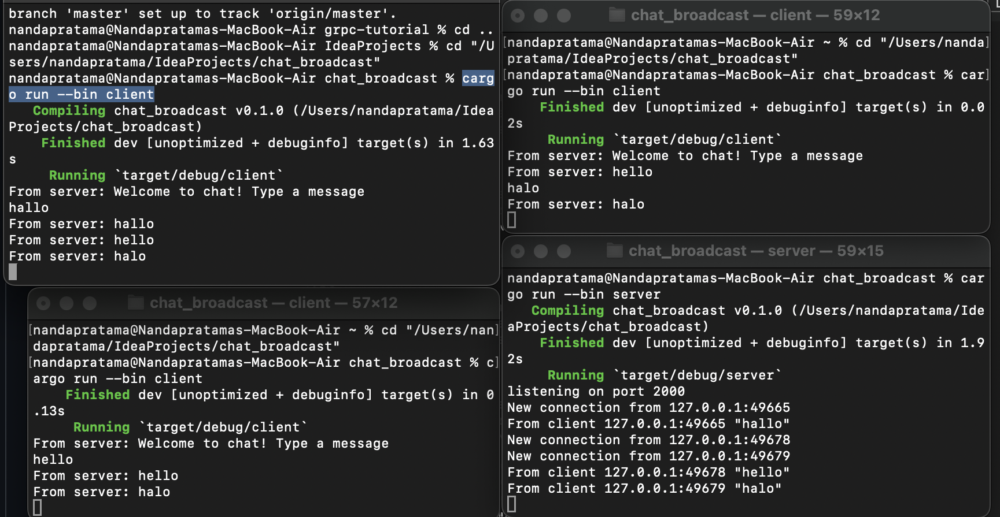

### Tutorial 10

**2.1. Original code of broadcast chat.** 

After the server and the client are running, the client can send a message to the server and the server will broadcast the message to all the clients.
We can see from the screenshot above that the server and the client get that the broadcast message from each client. Every client can send a message to the server and the server will broadcast the message to all the clients.    

