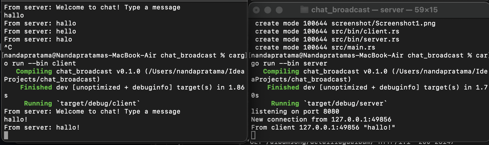
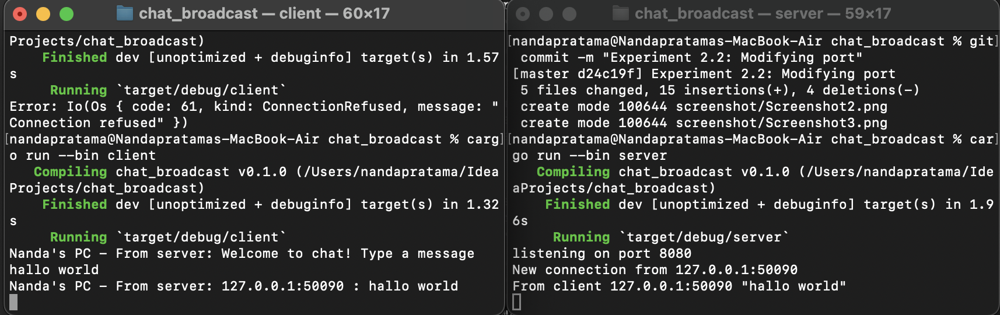

### Tutorial 10

**2.1. Original code of broadcast chat.** 

After the server and the client are running, the client can send a message to the server and the server will broadcast the message to all the clients.
We can see from the screenshot above that the server and the client get that the broadcast message from each client. 
Every client can send a message to the server and the server will broadcast the message to all the clients.  

**2.2. Modifying the websocket port** 

If the client and the server are running on the same port, the client can send a message to the server and the server will broadcast the message. Just like before.

But, if we change the port of either the server or the client so that they are different, an error will occur. The client won't be able to send a message to the server, and the server won't be able to broadcast the message to the client.

**2.3. Small changes. Add some information to client**

The result can be achieved by modifying bcast.tx in the server and output text in the client.
